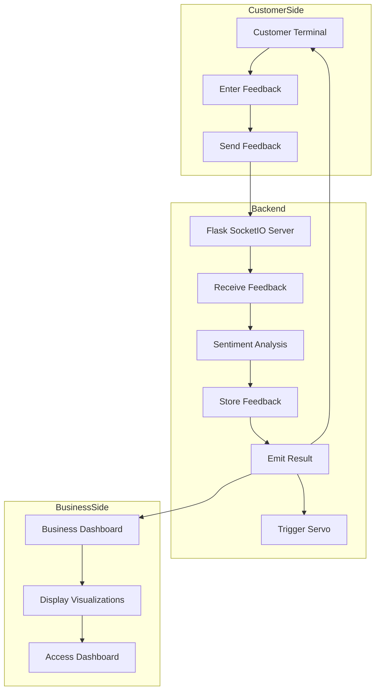

# Business Dashboard

A real-time sentiment analysis dashboard for restaurant feedback using Flask, SocketIO, and Plotly.

## Features

- Real-time sentiment analysis of customer feedback
- Interactive visualizations:
  - Sentiment distribution pie chart
  - Sentiment trend line chart
- WebSocket-based live updates
- Responsive dashboard design

## Customer Feedback Flow Chart



## Setup

1. Install dependencies:
```bash
pip install -r requirements.txt
```

2. Run the subscriber server:
```bash
python sub.py
```

3. Run the publisher to submit feedback:
```bash
python publisher.py
```

4. Access the dashboard at http://localhost:5001

## Project Structure

- `sub.py`: Flask server with WebSocket support and dashboard
- `publisher.py`: Feedback submission interface
- `sentiment.py`: Sentiment analysis module
- `models.py`: Database models
- `templates/`: HTML templates
- `static/`: CSS, JavaScript, and other static files

## Technologies Used

- Flask
- Flask-SocketIO
- Plotly
- SQLAlchemy
- OpenAI GPT-3.5 